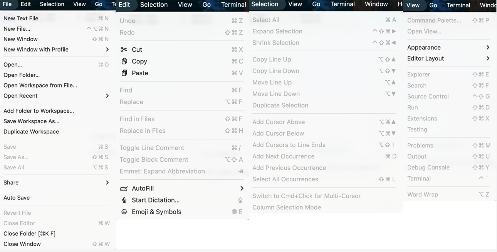

# Kiến thức cơ bản về Môi trường Phát triển Tích hợp (IDE)

::: tip 💡 Hướng dẫn học tập
Chương này sẽ đưa bạn đi sâu vào công cụ năng suất cốt lõi của lập trình viên – **Môi trường Phát triển Tích hợp (IDE)**. Chúng ta sẽ bắt đầu từ triết lý thiết kế của IDE, lần lượt phân tích các thành phần cốt lõi của nó, và trình bày nguyên lý hoạt động thông qua một IDE ảo.
:::

## Làm gì khi gặp vấn đề không hiểu? (How to solve problems)

Trong quá trình học và sử dụng IDE, bạn có thể gặp phải nhiều nút, menu hoặc lỗi code không hiểu. Lúc này, **đừng hoảng sợ, sử dụng trợ lý AI là cách giải quyết hiệu quả nhất**.

**Cách làm được khuyến nghị: Chụp ảnh màn hình và hỏi AI**

Các AI hiện nay (như ChatGPT, Claude, DeepSeek, v.v.) đều có khả năng nhận diện hình ảnh mạnh mẽ. Khi bạn gặp một yếu tố giao diện không quen thuộc hoặc một đoạn code phức tạp:

1.  **Chụp ảnh màn hình**: Chụp phần bạn không hiểu (ví dụ: một biểu tượng lạ, hoặc một đoạn code cấu hình phức tạp).
2.  **Đặt câu hỏi**: Gửi hình ảnh cho AI và hỏi: "Đây là gì? Nó có tác dụng gì?" hoặc "xxx trong đoạn code này dùng để làm gì?".
3.  **Hỏi thêm**: Nếu câu trả lời của AI quá chuyên nghiệp và khó hiểu, hãy tiếp tục hỏi: "Xin hãy giải thích bằng ngôn ngữ đời thường, tốt nhất là cho một ví dụ trong cuộc sống."

<AiHelpDemo />

---

## 0. Giới thiệu: Tại sao cần IDE?

Trong quá trình phát triển phần mềm, lập trình viên cần thường xuyên thực hiện các thao tác như viết code, quản lý file, biên dịch và chạy chương trình, gỡ lỗi. Nếu những thao tác này đều phải được hoàn thành trong các phần mềm độc lập khác nhau (ví dụ: dùng Notepad để viết code, dùng dòng lệnh để biên dịch, dùng thư mục để quản lý file), hiệu suất sẽ cực kỳ thấp và dễ xảy ra lỗi.

Giá trị cốt lõi của **IDE (Integrated Development Environment)** nằm ở sự **tích hợp**. Nó hợp nhất các công cụ cần thiết cho phát triển phần mềm (trình soạn thảo, trình biên dịch, trình gỡ lỗi, trình quản lý file, v.v.) vào một giao diện đồ họa thống nhất, cung cấp trải nghiệm làm việc một cửa.

**VS Code là một trong những IDE phổ biến nhất.** Mặc dù về bản chất nó là một trình soạn thảo code nhẹ, nhưng thông qua hệ thống plugin mạnh mẽ, nó sở hữu tất cả các chức năng cốt lõi của một IDE (chỉnh sửa code, gỡ lỗi, kiểm soát phiên bản, v.v.), do đó được coi là IDE được lựa chọn hàng đầu cho phát triển Frontend và Full Stack hiện đại.

Nói tóm lại, IDE được thiết kế để tối đa hóa năng suất của nhà phát triển, giảm thời gian chuyển đổi giữa các công cụ khác nhau.

> 🔗 **Tài nguyên tải xuống**:
>
> - [Tải xuống VS Code chính thức](https://code.visualstudio.com/Download)
> - [Trải nghiệm VS Code phiên bản web](https://vscode.dev/)
>
> **VS Code (Visual Studio Code)** là một trình soạn thảo code miễn phí, mã nguồn mở, đa nền tảng được phát triển bởi Microsoft. Với các đặc điểm như **nhẹ, nhiều plugin, khởi động nhanh**, nó đã trở thành một trong những công cụ phát triển phổ biến nhất trên thế giới. Dù bạn viết Python, JavaScript hay C++, VS Code đều có thể trở thành "công cụ thần kỳ" phù hợp nhất với bạn thông qua việc cài đặt plugin.

---

## 1. Phân tích giao diện cốt lõi

Bố cục giao diện của các IDE hiện đại (ví dụ VS Code) được thiết kế tỉ mỉ, thường bao gồm bốn khu vực cốt lõi sau:

1.  **Sidebar (Thanh bên): Quản lý tài nguyên**
    Hiển thị cây thư mục của dự án, hỗ trợ tạo mới, đổi tên, di chuyển và xóa file, cung cấp cái nhìn tổng quan về cấu trúc dự án và khả năng truy cập nhanh.

2.  **Editor Area (Khu vực soạn thảo): Sáng tạo code**
    Khu vực cốt lõi để viết và sửa đổi code. Hỗ trợ tô sáng cú pháp, tự động hoàn thành code thông minh, kiểm tra cú pháp, v.v., cung cấp môi trường viết code hiệu quả và thông minh.

3.  **Panel (Bảng điều khiển dưới): Thực thi và phản hồi**
    Tương tác với hệ thống cấp thấp và xem kết quả chạy. Bao gồm Terminal, Output, v.v., dùng để thực thi lệnh, xem log và gỡ lỗi.

4.  **Activity Bar (Thanh hoạt động): Điều hướng chức năng**
    Nằm ở phía ngoài cùng bên trái của giao diện, chứa các biểu tượng như trình khám phá file, tìm kiếm, quản lý Git, v.v., dùng để chuyển đổi nhanh chóng giữa các ngữ cảnh làm việc khác nhau (ví dụ: "viết code" và "commit code").

---

## 2. Trình diễn tương tác: Trải nghiệm chức năng

Trăm nghe không bằng một thấy. Để bạn thực sự cảm nhận được sự tiện lợi của IDE, chúng tôi đã chuẩn bị một **môi trường VS Code ảo** cho bạn.

**Hãy thử các thao tác sau**:

1.  Nhấp vào **"▶ Bắt đầu tự động hướng dẫn"** ở góc trên bên phải, làm theo con trỏ để tìm hiểu từng khu vực.
2.  **Tự do khám phá**: Nhấp vào các biểu tượng bên trái để chuyển đổi chế độ xem, hoặc nhấp vào tên file để mở code.
3.  **Trải nghiệm tích hợp**: Bạn sẽ thấy rằng việc quản lý file, chỉnh sửa code, chạy Terminal đều được kết nối liền mạch trong cùng một cửa sổ.
4.  **Cài đặt plugin**: Chọn chế độ **"Cài đặt Plugin (Extensions)"** trong menu thả xuống để trải nghiệm cách cài đặt plugin Python trong cửa hàng ảo.

<ClientOnly>
  <VirtualVSCodeDemo />
</ClientOnly>

---

## 3. Cơ chế cốt lõi: Tại sao VS Code lại "vô sở bất năng"?

Bạn có thể tò mò: Tại sao cùng một phần mềm lại có thể viết Python, C++ và cả phát triển web? Nó làm điều đó như thế nào?
Thực ra, triết lý thiết kế của VS Code có thể tóm gọn trong một câu: **"Cốt lõi tối giản, khả năng mở rộng bên ngoài."**

### 3.1 Cốt lõi tối giản: Chỉ là một "bảng vẽ"

Hãy tưởng tượng, VS Code mà bạn vừa tải xuống, nếu không cài đặt bất kỳ plugin nào, nó thực sự **không hiểu lập trình**.
Lúc này, về bản chất, nó chỉ là một **trình soạn thảo văn bản mạnh mẽ**.

- Nó chịu trách nhiệm hiển thị văn bản (rendering).
- Nó chịu trách nhiệm quản lý file (IO).
- Nhưng nó không biết `print("Hello")` là code Python, cũng không biết `int main()` là điểm vào của C++.

### 3.2 Hệ thống Plugin: Thổi "linh hồn" vào

Để VS Code có thể "hiểu" code, chúng ta cần cài đặt **Plugin (Extensions)**.
Plugin giống như những **phiên dịch viên** chuyên nghiệp:

-   **Plugin Python**: Cho VS Code biết đâu là biến, đâu là hàm, cách chạy file `.py`.
-   **Plugin C++**: Cho VS Code biết cách gọi trình biên dịch, cách gỡ lỗi bộ nhớ.

Thiết kế này làm cho VS Code rất nhẹ – bạn không viết Java, thì không cần phải gánh môi trường chạy của Java.

### 3.3 Quy trình hậu trường: Từ code đến chạy

<ClientOnly>
  <IdeArchitectureDemo />
</ClientOnly>

Hãy cùng xem xét một kịch bản cụ thể để hiểu cách VS Code, plugin và môi trường cấp thấp phối hợp với nhau.
Giả sử bạn viết một dòng code Python và nhấp vào **chạy** hoặc **gỡ lỗi**:

#### 1. Nhận diện ngôn ngữ (Activation)

VS Code phát hiện hậu tố `.py`, tự động kích hoạt **Plugin Python**. Plugin ngay lập tức tiếp quản trình soạn thảo, bắt đầu phân tích cú pháp, tô màu code khác nhau (tô sáng cú pháp) và cung cấp gợi ý thông minh.

#### 2. Ủy quyền tác vụ (Delegation)

Khi bạn đưa ra lệnh, bản thân plugin không trực tiếp thực thi code, mà **ủy quyền** tác vụ cho các công cụ chuyên nghiệp cấp thấp:

-   **Chế độ chạy**: Plugin tạo một lệnh (ví dụ: `python main.py`), gửi đến **Terminal** của hệ thống để thực thi.
-   **Chế độ gỡ lỗi**: Plugin khởi động một **Debug Adapter**. Nó giống như một "đầu dò giám sát", kết nối với bên trong trình thông dịch Python, cho phép bạn kiểm soát việc thực thi code từng dòng một.

#### 3. Phản hồi kết quả (Feedback)

Trình thông dịch Python (hoặc trình biên dịch) thực thi xong code, trả về kết quả (hoặc thông báo lỗi) cho plugin. Plugin sau đó "chuyển" thông tin này trở lại, hiển thị trong **bảng điều khiển Terminal dưới cùng** của VS Code.

### 3.4 Tóm tắt: Lấy "nhà hàng" làm ví dụ

Nếu thấy công thức trên hơi trừu tượng, chúng ta có thể hình dung quá trình viết code giống như **đi ăn ở nhà hàng**:

1.  **VS Code là "sảnh nhà hàng"**:
    -   Nơi đây trang trí sang trọng, môi trường thoải mái (tô sáng code, chủ đề đẹp mắt).
    -   **Nhưng sảnh không tự sản xuất thức ăn**. Bạn ngồi đây chỉ để "gọi món" thoải mái hơn (viết code).

2.  **Môi trường (Python/Node) là "nhà bếp"**:
    -   Đây là nơi thực sự **nấu ăn (chạy code)**.
    -   Nếu nhà hàng không có nhà bếp (chưa cài Python), bạn ngồi ở sảnh đến tối cũng không có gì ăn.

3.  **Plugin là "người phục vụ"**:
    -   Anh ta kết nối sảnh và nhà bếp.
    -   Anh ta hiểu menu của bạn, chạy vào nói với nhà bếp: "Bàn số 3 muốn một món 'chạy main.py'!"
    -   Khi món ăn đã sẵn sàng, anh ta lại mang kết quả (món ăn nóng hổi) ra trước mặt bạn.

**Kết luận**:

-   Chỉ cài VS Code = **Chỉ có sảnh không có nhà bếp** (chỉ có thể nhìn, không thể ăn).
-   Chỉ cài Python = **Chỉ có nhà bếp không có sảnh** (có thể ăn, nhưng phải ngồi dưới sàn bếp ăn, trải nghiệm rất tệ).
-   **Cài VS Code + Plugin + Python = Trải nghiệm ăn uống hoàn hảo.**

---

# Phụ lục: Phân tích thanh menu của Visual Studio Code

Để tiện cho mọi người hiểu ý nghĩa của từng tùy chọn, dưới đây chúng tôi sẽ phân tích sâu về thanh menu:

  
File (Tệp): Mở/lưu/quản lý không gian làm việc của dự án và tệp

Menu này chủ yếu chịu trách nhiệm: **Tạo/mở tệp**, **mở thư mục dự án (Folder)**, **quản lý không gian làm việc (Workspace)**, **lưu và đóng**.

> Trong đó, các thao tác thường dùng nhất là: Open Folder (Mở thư mục) để mở một dự án; Open… (Mở…) để mở riêng một tệp; sau đó dùng Save / Save All (Lưu / Lưu tất cả) để lưu các thay đổi, cuối cùng dùng Close Editor / Close Folder (Đóng trình soạn thảo / Đóng thư mục) để kết thúc công việc. Các nội dung như Workspace (Không gian làm việc), Duplicate Workspace (Sao chép không gian làm việc) có thể tìm hiểu dần khi bạn có nhiều dự án, không cần phải hiểu hết ngay từ đầu.

-   **New Text File (Tạo tệp văn bản mới)**: Tạo một bộ đệm văn bản chưa đặt tên, dùng để ghi chú tạm thời hoặc dán nhanh nội dung.
-   **New File… (Tạo tệp mới…)**: Tạo tệp mới trong dự án (thường yêu cầu bạn chọn đường dẫn/đặt tên).
-   **New Window (Cửa sổ mới)**: Mở một phiên bản cửa sổ VS Code mới.
-   **New Window with Profile (Mở cửa sổ mới với Profile)**: Mở cửa sổ mới với Profile (tổ hợp tiện ích mở rộng/cài đặt) được chỉ định, phù hợp để cô lập môi trường cho các khóa học/dự án khác nhau.
-   **Open… (Mở…)**: Mở một tệp riêng lẻ để chỉnh sửa.
-   **Open Folder… (Mở thư mục…)**: Mở một thư mục làm thư mục gốc của dự án (cách "mở dự án" phổ biến nhất).
-   **Open Workspace from File… (Mở không gian làm việc từ tệp…)**: Mở tệp `.code-workspace`, tải không gian làm việc đa thư mục/cài đặt cụ thể.
-   **Open Recent (Mở gần đây)**: Nhanh chóng truy cập các tệp/thư mục/không gian làm việc đã mở gần đây.
-   **Add Folder to Workspace… (Thêm thư mục vào không gian làm việc…)**: Thêm một thư mục khác vào không gian làm việc hiện tại (tạo thành multi-root workspace).
-   **Save Workspace As… (Lưu không gian làm việc thành…)**: Lưu cấu trúc không gian làm việc hiện tại thành tệp `.code-workspace`, tiện lợi cho việc chia sẻ/tái sử dụng.
-   **Duplicate Workspace (Sao chép không gian làm việc)**: Sao chép cấu hình không gian làm việc hiện tại (thường dùng để thiết lập môi trường dự án tương tự).
-   **Save (Lưu)**: Lưu các thay đổi của tệp hiện tại.
-   **Save As… (Lưu thành…)**: Lưu tệp hiện tại với tên/đường dẫn mới.
-   **Save All (Lưu tất cả)**: Lưu tất cả các tệp đã mở và có thay đổi.

-   **Share (Chia sẻ)**: Điểm truy cập liên quan đến chia sẻ/hợp tác (nội dung cụ thể tùy thuộc vào phiên bản và tiện ích mở rộng).
-   **Auto Save (Tự động lưu)**: Chuyển đổi chiến lược tự động lưu (ví dụ: lưu sau một khoảng thời gian/lưu khi mất tiêu điểm).
-   **Revert File (Hoàn tác tệp)**: Hủy bỏ các thay đổi chưa lưu của tệp hiện tại, trở về phiên bản trên đĩa.
-   **Close Editor (Đóng trình soạn thảo)**: Đóng tab hiện tại.
-   **Close Folder (Đóng thư mục)**: Đóng thư mục dự án hiện tại (không gian làm việc trở nên trống rỗng).
-   **Close Window (Đóng cửa sổ)**: Đóng cửa sổ VS Code hiện tại.

  
Edit (Chỉnh sửa): Chỉnh sửa cơ bản, tìm kiếm thay thế, chú thích và các thao tác chỉnh sửa nhanh

Menu này chủ yếu chịu trách nhiệm: **Hoàn tác/làm lại**, **cắt/sao chép/dán**, **tìm kiếm thay thế**, **chú thích và các thao tác của trình soạn thảo** (nâng cao hiệu quả chỉnh sửa).

-   **Undo / Redo (Hoàn tác / Làm lại)**: Thuốc hối hận khi viết code sai, thao tác cơ bản nhất.
-   **Cut / Copy / Paste (Cắt / Sao chép / Dán)**: Công cụ vận chuyển văn bản.
-   **Find / Replace (Tìm kiếm / Thay thế)**: Tìm kiếm hoặc thay đổi hàng loạt trong tệp hiện tại.
-   **Find in Files / Replace in Files (Tìm kiếm trong tệp / Thay thế trong tệp)**: Tìm kiếm và thay thế toàn cục (toàn bộ dự án), rất mạnh mẽ nhưng cần thận trọng khi sử dụng.
-   **Toggle Line Comment (Chuyển đổi chú thích dòng)**: `Ctrl + /`, nhanh chóng chú thích/bỏ chú thích dòng hiện tại.
-   **Toggle Block Comment (Chuyển đổi chú thích khối)**: `Shift + Alt + A`, nhanh chóng chú thích/bỏ chú thích vùng chọn.
-   **Emmet: Expand Abbreviation (Mở rộng Emmet)**: Công cụ thần kỳ cho phát triển HTML/CSS, nhập viết tắt và nhấn Tab để mở rộng code.

  
Selection (Lựa chọn): Đa con trỏ và vùng chọn thông minh

Menu này chủ yếu chịu trách nhiệm: **Điều khiển con trỏ**, **chỉnh sửa đa dòng**, **mở rộng/thu hẹp vùng chọn**. Đây là một trong những tính năng sát thủ của VS Code giúp nâng cao hiệu quả.

-   **Select All (Chọn tất cả)**: Chọn tất cả nội dung trong tệp hiện tại.
-   **Expand Selection / Shrink Selection (Mở rộng / Thu hẹp vùng chọn)**: Tự động nhận diện cấu trúc cú pháp, dần dần mở rộng hoặc thu hẹp phạm vi chọn (ví dụ: từ từ -> chuỗi -> trong dấu ngoặc -> toàn bộ dòng -> thân hàm).
-   **Copy Line Up / Down (Sao chép dòng lên / xuống)**: Nhanh chóng nhân bản dòng hiện tại.
-   **Move Line Up / Down (Di chuyển dòng lên / xuống)**: `Alt + ↑ / ↓`, điều chỉnh thứ tự dòng code trực tiếp mà không cần cắt dán.
-   **Add Cursor Above / Below (Thêm con trỏ phía trên / phía dưới)**: `Ctrl + Alt + ↑ / ↓`, bật chế độ đa con trỏ, chỉnh sửa nhiều dòng cùng lúc.
-   **Add Cursor to Line Ends (Thêm con trỏ vào cuối dòng)**: Sau khi chọn nhiều dòng văn bản, thêm con trỏ vào cuối mỗi dòng.

  
View (Xem): Bố cục giao diện và điều khiển bảng điều khiển

Menu này chủ yếu chịu trách nhiệm: **Bật/tắt thanh bên/bảng điều khiển**, **điều chỉnh bố cục**, **bảng lệnh**, **Output và Debug Console**.

-   **Command Palette… (Bảng lệnh…)**: `Ctrl + Shift + P` / `F1`, trung tâm chỉ huy tổng thể của VS Code, có thể tìm kiếm và thực thi tất cả các lệnh.
-   **Open View… (Mở chế độ xem…)**: Nhanh chóng mở các chế độ xem thanh bên cụ thể (như Explorer, Source Control).
-   **Appearance (Giao diện)**: Điều khiển chế độ toàn màn hình, hiển thị/ẩn thanh menu, vị trí thanh bên, mức độ phóng to/thu nhỏ (Zoom In/Out).
-   **Editor Layout (Bố cục trình soạn thảo)**: Chia trình soạn thảo (Split Up/Down/Left/Right), thực hiện chia màn hình để so sánh code.
-   **Explorer / Search / Source Control / Run / Extensions**: Trực tiếp chuyển đổi chế độ xem của Activity Bar.
-   **Problems / Output / Debug Console / Terminal**: Trực tiếp điều khiển nội dung hiển thị của Panel dưới cùng.
-   **Word Wrap (Tự động xuống dòng)**: `Alt + Z`, điều khiển xem các dòng code dài có tự động xuống dòng hiển thị hay không (không ảnh hưởng đến nội dung tệp thực tế).

  
Go (Đi tới): Điều hướng và nhảy code

Menu này chủ yếu chịu trách nhiệm: **Nhảy giữa các tệp**, **nhảy giữa các ký hiệu (hàm/biến)**.

-   **Back / Forward (Quay lại / Tiến lên)**: Giống như trình duyệt, nhảy giữa các vị trí lịch sử con trỏ của bạn.
-   **Switch Editor… (Chuyển trình soạn thảo…)**: Nhanh chóng chuyển đổi giữa các tab đã mở.
-   **Go to File… (Đi tới tệp…)**: `Ctrl + P`, nhập tên tệp để mở nhanh tệp.
-   **Go to Symbol in Editor… (Đi tới ký hiệu trong trình soạn thảo…)**: `Ctrl + Shift + O`, liệt kê các hàm/lớp/biến của tệp hiện tại, nhảy nhanh.
-   **Go to Definition (Đi tới định nghĩa)**: `F12`, nhảy đến nơi định nghĩa của biến hoặc hàm tại vị trí con trỏ.
-   **Go to References (Đi tới tham chiếu)**: `Shift + F12`, xem biến hoặc hàm đó được sử dụng ở những đâu.
-   **Go to Line/Column… (Đi tới dòng/cột…)**: `Ctrl + G`, nhảy đến số dòng được chỉ định.

  
Run (Chạy): Gỡ lỗi và thực thi

Menu này chủ yếu chịu trách nhiệm: **Khởi động gỡ lỗi**, **quản lý điểm dừng (breakpoint)**.

-   **Start Debugging (Bắt đầu gỡ lỗi)**: `F5`, chạy chương trình ở chế độ gỡ lỗi (hỗ trợ breakpoint, theo dõi biến).
-   **Run Without Debugging (Chạy không gỡ lỗi)**: `Ctrl + F5`, chạy trực tiếp chương trình, không giữ trình gỡ lỗi (tốc độ nhanh hơn một chút).
-   **Stop Debugging (Dừng gỡ lỗi)**: Buộc kết thúc phiên gỡ lỗi hiện tại.
-   **Restart Debugging (Khởi động lại gỡ lỗi)**: Chạy lại.
-   **Toggle Breakpoint (Chuyển đổi điểm dừng)**: `F9`, đặt hoặc hủy bỏ chấm đỏ (breakpoint) tại dòng hiện tại.
-   **New Breakpoint (Tạo điểm dừng mới)**: Hỗ trợ các chức năng nâng cao như conditional breakpoint, log breakpoint.

  
Terminal (Thiết bị đầu cuối): Dòng lệnh tích hợp

Menu này chủ yếu chịu trách nhiệm: **Tạo Terminal mới**, **quản lý cửa sổ Terminal**.

-   **New Terminal (Terminal mới)**: Mở một Shell mới (PowerShell/Bash/Zsh) trong bảng điều khiển dưới cùng.
-   **Split Terminal (Chia Terminal)**: Chia Terminal theo chiều ngang/dọc trong cùng một bảng điều khiển Terminal, chạy nhiều lệnh cùng lúc.
-   **Run Task… (Chạy tác vụ…)**: Chạy các tác vụ build/test được định nghĩa trong `tasks.json`.

  
Help (Trợ giúp): Tài liệu và phản hồi

-   **Welcome (Chào mừng)**: Mở trang chào mừng (bao gồm hướng dẫn bắt đầu, các dự án gần đây).
-   **Show All Commands (Hiển thị tất cả lệnh)**: Giống như Command Palette.
-   **Documentation (Tài liệu)**: Chuyển đến tài liệu chính thức.
-   **Editor Playground (Sân chơi trình soạn thảo)**: Hướng dẫn tương tác, học các kỹ thuật chỉnh sửa.
-   **Check for Updates… (Kiểm tra cập nhật…)**: Kiểm tra cập nhật thủ công.
-   **About (Giới thiệu)**: Xem số phiên bản, thời gian build, thông tin phiên bản Electron/Node.

