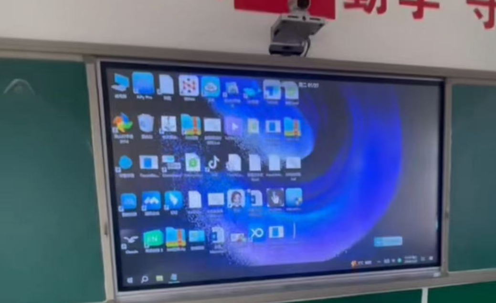
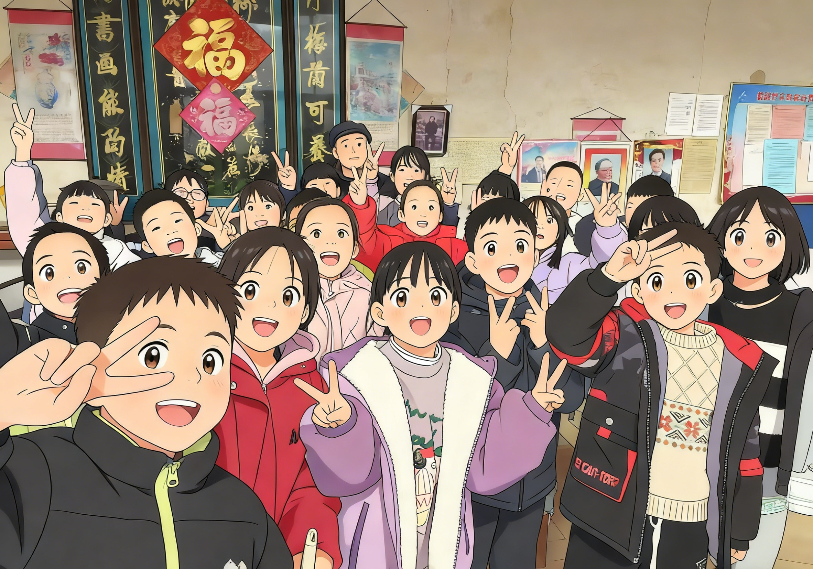
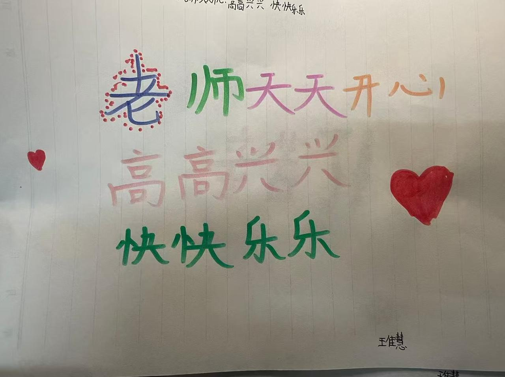
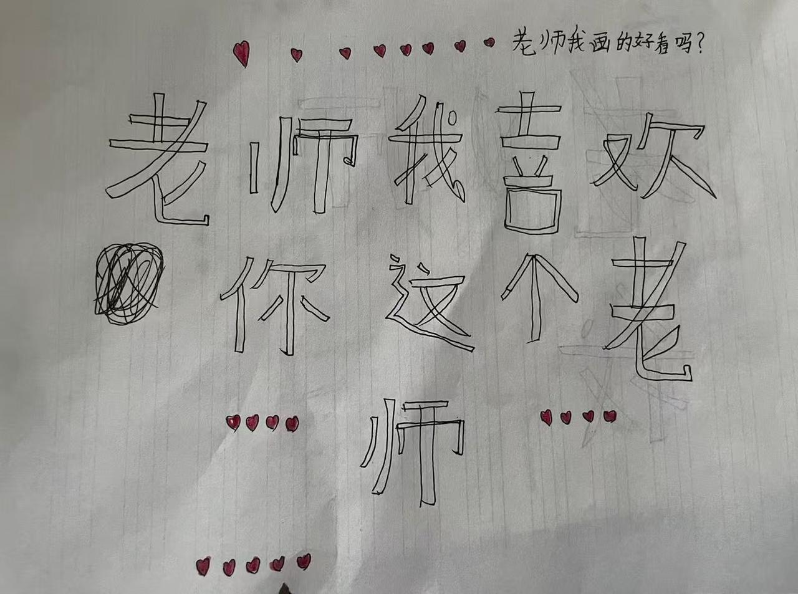

# Từ bỏ thu nhập cao, anh về làng dạy trẻ "đuổi ruồi bằng AI"

👨‍🏫

**Người kể: Tiểu Hạo — giáo viên tiểu học**

Tiểu Hạo là giáo viên dạy hợp đồng lớp 3 ở một trường tiểu học nông thôn. Trước đây anh từng làm vận hành, phân tích dữ liệu kinh doanh, rồi cả lập trình — thu nhập hàng tháng cũng kha khá. Trong mắt nhiều người, chàng trai xuất thân từ vùng quê này đã "thành đạt". Nhưng anh từ bỏ công việc được ngưỡng mộ, về quê để đưa các em nhỏ nông thôn ra nhìn thế giới rộng lớn hơn.

## 01 Lần đầu tiên "trí tuệ nhân tạo" xuất hiện trong lớp học

Mới về làng dạy học, lòng thầy Tiểu Hạo nặng trĩu. "Điều kiện ở làng có hạn, các em khó có cơ hội nhìn ra thế giới bên ngoài. Thế giới của chúng rất nhỏ — chỉ có sách giáo khoa cũ kỹ và mảnh đất dưới chân." Anh muốn cho các em thấy thế giới rộng lớn hơn, muốn nói với chúng rằng trên đời này có thứ gọi là "trí tuệ nhân tạo" — có thể vẽ tranh, làm thơ, trả lời mọi câu hỏi bay bổng trong đầu.

Ban đầu không suôn sẻ chút nào. Ý tưởng cho học sinh tự mang điện thoại đến trường để tiếp cận AI bị ban giám hiệu phản đối kịch liệt: "Anh đang cho trẻ sao chép câu trả lời! Đây là không làm đúng bổn phận!" Nhưng anh không bỏ cuộc, ngày này qua ngày khác tìm cách thuyết phục ban giám hiệu. Cuối cùng hai bên nhường nhau một bước: được học AI, nhưng không vi phạm quy định nhà trường — học sinh không được tự mang điện thoại vào lớp.

Vậy là thầy Tiểu Hạo tự bỏ tiền túi mua vài chiếc điện thoại cũ, đăng nhập tài khoản AI của mình vào đó cho các em dùng. Thế là lần đầu tiên, các em được chạm tay vào "công nghệ cao". Chúng nhanh chóng học cách dùng AI để tra tài liệu, học nhảy, thậm chí thử tạo ảnh từ văn bản. AI lần đầu tiên mở ra cánh cửa đến thế giới mới cho những đứa trẻ này.

## 02 "Đặc sản" của lớp học nông thôn: Ruồi và chạm nhầm

Giờ đây các lớp học nông thôn cũng được lắp màn hình điện tử đa phương tiện — điều này cải thiện hiệu quả giảng dạy đáng kể và thúc đẩy công bằng giáo dục. Nhưng trong thực tế giảng dạy, vẫn còn nhiều rắc rối khó giải quyết. Ví dụ như... ruồi.

Màn hình điện tử tỏa nhiệt và phát sáng, ruồi đặc biệt thích bu vào. Màn hình không phân biệt được thao tác bình thường hay chạm nhầm, thường gây ra tình trạng bài giảng nhảy loạn, video tạm dừng, thậm chí tắt máy giữa chừng. Một tiết 40 phút, phải mất 20 phút đuổi ruồi trên bục giảng — tiết học bị cắt vụn, thầy Tiểu Hạo và các em đều khổ sở.

Một hôm, một em học sinh giơ tay hỏi thầy Tiểu Hạo: "Thầy ơi, chúng ta có thể cùng làm một chương trình để nhốt ruồi ở ngoài không?"

## 03 Trận chiến với ruồi — chúng ta thắng nhờ "trò chuyện" với AI

Cùng bọn trẻ lớp 3 viết code, lại còn làm chương trình chống chạm nhầm đòi hỏi kỹ thuật và kiến thức cao — điều này trước đây không dám nghĩ tới. Nhưng bây giờ khác rồi. Có AI giúp sức, mọi thứ đều có thể.

Tình cờ thấy một bộ tài liệu Vibe Coding phục vụ cộng đồng, thầy Tiểu Hạo đã dẫn các em cùng "chơi". Các em đưa ra ý tưởng, thầy đóng vai "phiên dịch viên", chuyển lời các em thành ngôn ngữ cho AI hiểu. Không cần vật lộn với cú pháp phức tạp, con trỏ, handle, hàng đợi tin nhắn tầng thấp — tất cả chướng ngại vật đó đều có AI chặn lại phía sau.

- "Này, máy tính có phân biệt được không — bây giờ là chuột đang nhấp, hay màn hình tự di chuyển?"
- "Có thể thêm một 'lớp phủ trong suốt' cho màn hình không — ruồi va vào không có phản ứng, nhưng dùng chuột vẫn thao tác được?"

Câu hỏi này mở ra hướng đi. AI cho biết cần phân biệt `RawInput`, cần nhận diện `ExtraInfo`. Dù các em không hiểu những thuật ngữ chuyên ngành này, nhưng qua quan sát dữ liệu và thảo luận nhóm, chúng phát hiện giá trị `ExtraInfo` của các loại đầu vào khác nhau thực sự có sự khác biệt.

Cứ thế, thầy Tiểu Hạo và các em bạn luân phiên trò chuyện với AI, từng câu từng câu "nói chuyện" ra được sản phẩm hiện tại: **Khóa Màn Hình Tiểu Hạo**. Nguyên lý khá đơn giản: nhận diện đặc trưng tín hiệu đầu vào, chặn chính xác tín hiệu cảm ứng của màn hình, chỉ giữ lại thao tác chuột. Như vậy dù ruồi có mở tiệc trên màn hình thế nào, bài giảng vẫn vững như bàn thạch.

Dù phần mềm này không phải sản phẩm thương mại cao cấp, nhưng nó thực sự giải quyết được điểm đau thực tế của lớp học nông thôn. Đây không chỉ là một chương trình — đây là lần đầu tiên các em tham gia sáng tạo, lần đầu tiên dùng công nghệ để đáp lại những vấn đề trong cuộc sống.

## 04 Từ viết một dòng code đến gõ một cánh cửa

Điều thầy Tiểu Hạo nhớ nhất là ngày Tết Dương lịch. Anh hỏi AI: "Làm thế nào để đưa các em đón một cái Tết có ý nghĩa?" AI không gợi ý tổ chức tiệc, cũng không gợi ý biểu diễn, mà nói: "Thay vì ăn mừng trong lớp học, hãy đến thăm những cụ già cô đơn trong làng."

Vậy là anh thực sự dẫn các em đến thăm một cụ già sống một mình trong làng. Khi đến nơi, cụ đang ngồi trên chiếc ghế gỗ cũ ăn bữa trưa — trên bàn chỉ có một bát mì nấu nước trắng và một đĩa dưa mặn. Lòng thầy Tiểu Hạo thắt lại, tiếc vì không mang thêm đồ ăn. Những đứa trẻ thường ngày nghịch ngợm nhất đều ngoan hơn bình thường, còn ngồi trò chuyện với cụ.

Ra về, vài em kéo áo thầy Tiểu Hạo, mắt đỏ hoe nói: "Thầy ơi, sau này chúng mình hay đến giúp cụ nhé." Trên đường về hôm đó, gió lạnh cắt vào mặt buốt rát, nhưng lòng anh ấm áp lạ thường.

Anh nói: "Giáo dục không chỉ là dạy kiến thức sách vở, còn phải dạy lòng người. Câu trả lời AI đưa ra không bao giờ chỉ là kỹ thuật — mà còn là trái tim được nó thắp lên, muốn sưởi ấm người khác."

## 05 Đôi lời từ trái tim thầy Tiểu Hạo

Thực ra làm phần mềm này, thu hoạch lớn nhất không phải là phần mềm — mà là thấy ánh mắt rạng rỡ của các em. Trước đây các em nghĩ máy tính là đồ chơi của trẻ thành phố, lập trình là việc của thiên tài, chẳng liên quan gì đến mình. Nhưng bây giờ, chúng biết rằng chỉ cần có ý tưởng, chỉ cần dám nghĩ, thậm chí chỉ cần biết "nói chuyện" — chúng có thể thay đổi cuộc sống của mình qua AI.

Em học sinh đề xuất làm phần mềm — trước đây nghịch nhất lớp, bây giờ học chăm nhất lớp. Vì em biết rằng thứ mình tham gia tạo ra đang giúp mọi người giải quyết vấn đề. Sự tự tin "mình cũng làm được" đó quý giá hơn điểm 10 nhiều lắm.

Anh cũng thành thật chia sẻ rằng mình dẫn các em dùng điện thoại, tìm hiểu AI — không ít lần bị phê bình, cũng không ít lần nghe tiếng đồn. Nhiều người nói anh không lo làm đúng bổn phận, làm hỏng không khí học tập. Nhưng nhìn các em trở nên tò mò hơn, tốt bụng hơn nhờ AI, anh cảm thấy tất cả đều xứng đáng.

## 06 Lời cuối

Thầy Tiểu Hạo chân thành kêu gọi mọi người quan tâm hơn đến lớp học kỹ thuật số AI thực sự có thể triển khai trong giáo dục công lập. Thế giới nhỏ bé của những đứa trẻ nông thôn thực sự cần sự trợ giúp của AI hơn. AI không chỉ là công cụ — mà còn là cánh cửa sổ giúp các em kết nối với thế giới rộng lớn.

