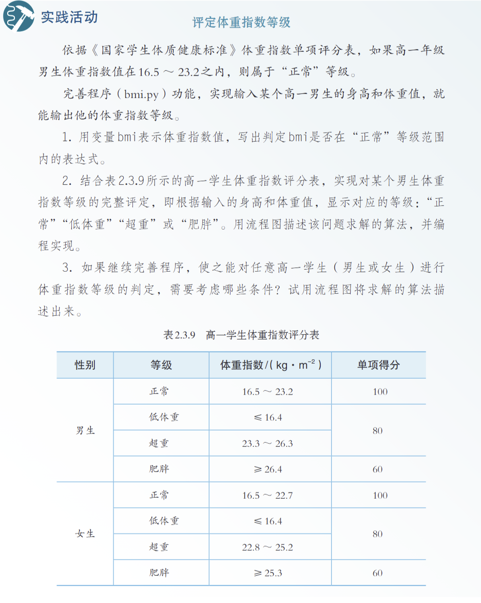

# Tôi tạo cho mỗi học sinh một "bạn học xuất sắc" không bao giờ mệt

🧑‍🏫

**Người kể: Một giáo viên tin học trung học**

Tôi là giáo viên tin học trung học, đồng thời là giám đốc trung tâm thông tin của trường, và là thành viên của đội ngũ giáo viên hạt giống AIGC thành phố Thạch Gia Trang. Những danh hiệu này nghe có vẻ rắc rối, nhưng nói thẳng ra, tôi đang làm ba việc: bồi dưỡng nhân tài cho đất nước, giảm gánh nặng cho giáo viên, nâng cao hiệu quả giảng dạy.

Vì vậy, tôi học AI và suy nghĩ cách ứng dụng — ban đầu vừa là yêu cầu công việc, vừa là sở thích cá nhân. Nhưng thứ thực sự thúc đẩy tôi quyết tâm làm gì đó, chính là môn học thực hành Python mà tôi phụ trách.

## 01 Tiết Python suýt "nhấn chìm" tôi

Nội dung của môn lập trình Python tôi dạy vốn không phức tạp. Chỉ cần học sinh viết chương trình tính chỉ số BMI — nhập chiều cao, cân nặng, phán đoán béo gầy, rồi xuất kết quả. Nhưng với học sinh hoàn toàn không có nền tảng lập trình, việc tiếp xúc một lĩnh vực hoàn toàn mới và hiểu được quy tắc vận hành là điều cực kỳ khó khăn.

Nhiều khi thầy giảng và học sinh hiểu hoàn toàn khác nhau. Vì vậy những nội dung đã giảng rồi, học sinh vẫn hỏi đi hỏi lại. Vừa giao nhiệm vụ xong, chẳng mấy chốc bốn phía đã đầy bàn tay giơ lên, tiếng "thầy ơi thầy ơi thầy ơi" nối tiếp nhau... Cảm giác đó giống như đứng giữa chợ, mỗi người bán hàng đều đang gọi mình.

50 học sinh, 1 giáo viên. Mỗi học sinh bị kẹt ở chỗ khác nhau: có người không hiểu `input()` dùng để làm gì, có người không biết viết câu lệnh `if` như thế nào, có người hoàn toàn không hiểu chuyển đổi kiểu dữ liệu. Một tiết 45 phút, tôi như công nhân không ngừng vặn ốc — vừa vặn chặt cái này, quay sang đã thấy ba cái kia lỏng ra.

Dù không dừng lại một giây, nhưng học sinh giơ tay hỏi hình như không bớt đi chút nào. Có em chờ mấy phút vẫn không gặp được tôi, thì bắt đầu tự mày mò máy tính; còn có em thì đơn giản là gục xuống ngủ. Lúc chuông báo hết giờ vang lên, tôi đứng trong phòng máy, nhìn cảnh hỗn loạn trước mắt, đột nhiên cảm thấy thật bất lực.

Không phải lỗi học sinh — các em đã rất cố gắng rồi. Cũng không phải tôi dạy không tốt, mà bản thân mô hình này có vấn đề. Lập trình không như Toán, không thể tổng hợp tất cả vấn đề giảng cho cả lớp cùng nghe, mà phải hướng dẫn từng người.

## 02 Trang bị cho mỗi học sinh một "bạn học xuất sắc" không biết mệt

Đêm hôm đó tôi mất ngủ. Không phải lo lắng, mà đang suy nghĩ một câu hỏi: nếu mỗi học sinh đều có một "trợ giảng" sẵn sàng giải đáp thắc mắc bất cứ lúc nào, thì sao?

Trợ giảng này không đưa đáp án trực tiếp, chỉ cần nói với em: "Chỗ này sai rồi", "Hàm này dùng thế này", "Thử nghĩ theo cách khác xem"...

Giống như hồi còn đi học, người bạn học xuất sắc ngồi bên cạnh. Em bị kẹt, hỏi một câu, bạn ấy gợi ý một chút, rồi tự em giải quyết được. Nghĩ đến đây, tôi đột nhiên nhận ra — AI có thể trở thành "bạn học xuất sắc ngồi cạnh" như vậy.

Các công cụ lập trình AI hiện có dù có thể đưa ra đáp án trực tiếp, nhưng chưa thực sự làm được việc hướng dẫn học tập. Vì vậy tôi quyết tâm tự làm một ứng dụng mới — một AI trợ giảng biết dạy, biết hướng dẫn, biết cùng học sinh suy nghĩ cho rõ vấn đề.

## 03 Từ ước mơ đến hiện thực: Bạn học lập trình

Trước đây tôi chỉ viết một vài phần mềm nhỏ đơn giản, chưa từng làm ứng dụng phức tạp như thế này. Về "phát triển ứng dụng tích hợp AI" thì hoàn toàn không có kinh nghiệm, nên ban đầu trong lòng rất không vững. Cũng từ lúc đó, tôi — một giáo viên "biết dạy nhưng không biết làm sản phẩm phức tạp" — lần đầu tiên thực sự biến ý tưởng trong đầu thành ứng dụng có thể sử dụng được.

Giai đoạn đó, tôi liên tục 5 ngày mỗi tối theo khóa học để học và thực hành. Phần khó nhất trong quá trình phát triển không phải là viết code, mà là tìm API của AI: nền tảng nào miễn phí, cái nào tốc độ nhanh, cái nào phù hợp với bối cảnh giáo dục... cái nào cũng phải thử từng cái.

Tôi vẫn nhớ lần đầu tiên tích hợp AI vào ứng dụng, gõ "hàm input dùng như thế nào", thấy nó thực sự trả về ví dụ code và giải thích — cảm giác phấn khích và vui mừng đó đến bây giờ vẫn còn. Tôi đặt tên ứng dụng này là "Trung tâm khóa học Tin học", module cốt lõi là "Bạn học lập trình".

Nó làm được ba việc:

- **Giải đáp kiến thức cơ bản**: Học sinh hỏi "vòng lặp for viết thế nào", "list dùng ra sao", bạn học đưa ngay cách dùng và code ví dụ. Vì đây là kiến thức cơ bản, không phải bài tập về nhà.
- **Hướng dẫn bài tập**: Học sinh mang đề bài thầy giao đến hỏi, bạn học không đưa code hoàn chỉnh, mà dùng phương pháp đặt câu hỏi kiểu Socrates để từng bước dẫn dắt em tự nghĩ ra.
- **Đánh giá code**: Học sinh dán code mình viết lên, bạn học chỉ ra vấn đề ở đâu, nhưng không tự sửa thay em.

Tại sao thiết kế như vậy? Vì mục đích học không phải là "hoàn thành bài tập", mà là "học cách giải quyết vấn đề". Nếu AI đưa đáp án thẳng, học sinh chỉ copy paste — bề ngoài xong việc, thực tế chẳng học được gì.

## 04 Bài tập và ghi chép trở thành rắc rối mới

Phần mềm làm xong, tôi tự test một vòng, thấy khá ổn. Đồng nghiệp xem xong cũng nói: "Cái này tuyệt lắm, giải quyết đúng điểm đau của chúng ta." Nhưng tuần đầu tiên sau khai học, vấn đề mới nảy sinh: học sinh dùng Bạn học lập trình giải quyết được vấn đề trong giờ học, rồi bài tập nộp ở đâu?

Trước đây chúng tôi dùng hệ thống lớp học điện tử, học sinh nộp bài trong phòng máy, tôi nhận trên máy giáo viên. Nhưng hệ thống này có vấn đề chết người — chỉ dùng được trong phòng máy, hết giờ là ngắt. Học sinh ra ngoài phòng máy, không thể tiếp tục làm bài khóa học, cũng không thể xem lại ghi chép học tập trước đó.

Vậy là tôi lại bỏ thêm vài tối để thêm vào "Bạn học lập trình" một hệ thống quản lý lớp học và khóa học hoàn chỉnh:

- Giáo viên có thể tạo lớp học và khóa học;
- Học sinh tham gia lớp, có thể xem tất cả nội dung khóa học và bài tập;
- Bài chưa làm xong trong giờ, sau giờ vẫn có thể tiếp tục làm và nộp;
- Giáo viên có thể chấm bài sau giờ học, bài không đạt thì trả lại làm lại;
- Khi học sinh vượt qua tất cả bài tập của một khóa học, hệ thống tự động cấp chứng chỉ hoàn thành khóa học.

"Chứng chỉ" này là tôi cố tình thêm vào. Vì tôi biết rằng, với học sinh trung học, một sự công nhận nhỏ và cảm giác nghi thức nhỏ đủ để các em cảm thấy "mình thực sự học được gì đó".

Bạn học lập trình kết hợp quản lý khóa học tạo thành một vòng khép kín học tập hoàn chỉnh, cũng khiến việc học của học sinh có đầu có đuôi, có thêm cảm giác thành tựu.

## 05 Giá mà mỗi giáo viên đều có thêm một người giúp đỡ

Bây giờ học sinh đang nghỉ hè. Dù hệ thống quản lý khóa học chưa thực sự triển khai quy mô lớn trong lớp học, nhưng phản hồi của đồng nghiệp sau khi test khiến tôi rất tự tin: "Đây chính là thứ chúng ta cần." Điều tôi không ngờ hơn là — hệ thống này thậm chí có thể được nhân rộng đến các trường khác trong toàn thành phố Thạch Gia Trang.

Ban đầu tôi làm hệ thống này, chỉ muốn giải quyết vấn đề cho 50 học sinh trong lớp mình, không nghĩ đến làm việc gì to lớn. Nhưng nghĩ lại — nếu tất cả giáo viên tin học trong thành phố đều đang đối mặt với khó khăn tương tự, tất cả học sinh đều đang gọi "thầy ơi", mà thầy chỉ có một người, thì công cụ này thực sự nên được nhiều người dùng hơn.

AI có thể chính là câu trả lời đó. Không phải dùng AI để thay thế giáo viên, mà dùng AI để hỗ trợ giáo viên — giúp mỗi học sinh nhận được sự hướng dẫn cá nhân hóa.

## 06 Lời kết

Cuối cùng nói một chút về triển khai kỹ thuật. Tôi dùng nền tảng Baidu Miaoda, triển khai 0 chi phí. Trường chúng tôi không có ngân sách máy chủ, nên "0 chi phí" này đặc biệt quan trọng. 5 ngày, sản phẩm từ ý tưởng đến ra mắt. Thậm chí từ lúc học Vibe Coding đến làm được ứng dụng, đều tận dụng thời gian rảnh buổi tối.

Tôi không phải nhà phát triển chuyên nghiệp, cũng không phải cao thủ kỹ thuật. Chỉ là một giáo viên tin học trung học bình thường, trong một đêm mất ngủ, muốn giải quyết một vấn đề thực tế. Sau đó tôi phát hiện ra — công nghệ thực sự có thể thay đổi giáo dục. Không phải kiểu "cách mạng giáo dục" hoành tráng, mà là sự thay đổi cụ thể, nhỏ bé, nhưng thực sự hiệu quả.

Nếu bạn cũng là giáo viên tin học, cũng đang đối mặt với khó khăn tương tự, hoặc bạn chỉ đơn giản quan tâm đến AI + giáo dục — hãy cùng trao đổi. Cùng nhau, để công nghệ thực sự phục vụ giáo dục.
