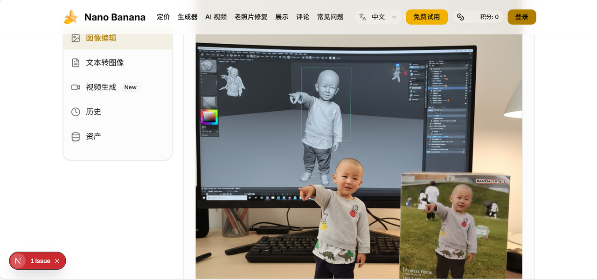
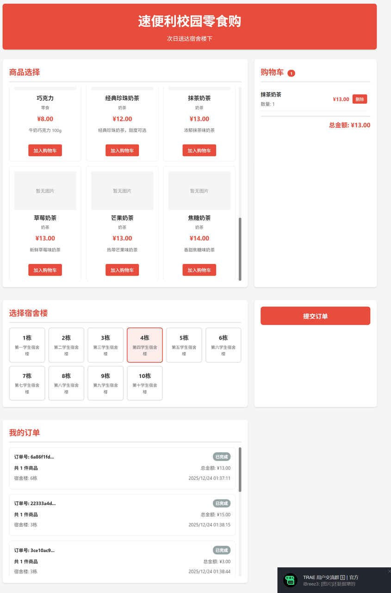

# Tài xế xe tải 48 tuổi, thức vài đêm trắng, dùng AI gõ ra một trang công cụ xuất ngoại

🚚

**Người kể: Lão Hoàng — tài xế xe tải**

## 01 "Tổng thống Nam Tư" quyết định đổi đường đua

"Năm nay tôi 48 tuổi, năm tuổi. Ở cái tuổi 'mười năm không chạm máy tính' này, sự bùng nổ của DeepSeek trong dịp Tết Nguyên Đán 2025 như một tiếng sét đánh thức tôi."

Lão Hoàng lớn lên ở Tiêu Tác — một thành phố nhỏ hạng tư — là "con nhà xưởng", vì hồi nhỏ có biệt danh nên mọi người thỉnh thoảng hay trêu anh bằng cái tên "Tổng thống Nam Tư". Bây giờ, người xung quanh gọi thẳng là Lão Hoàng.

Lão Hoàng là nhân viên vận chuyển hàng hóa cho máy bán hàng tự động. Sự bùng nổ của DeepSeek khiến anh nhận ra: "Đoàn tàu thời đại sắp chuyển bánh rồi, dù là người uống cà phê trong tòa nhà văn phòng hay người ăn bánh bao trong xe tải, đều sẽ bị làn sóng AI tác động. Không chạy theo kịp thì chỉ có thể bị bỏ lại ăn bụi."

Vậy là kẻ ngoại đạo hoàn toàn này quyết tâm học nghiêm túc. Anh muốn xem thử "đôi tay trước giờ chỉ biết lái xe, có gõ được cửa lập trình AI không."

## 02 Từ "thủ công nghiệp" đến "nghệ thuật chỉ huy"

Hai tuần đầu học, Lão Hoàng trong lòng trống trải: "Tôi còn không biết code trông như thế nào, liệu có được không?"

Nhưng những lời của thầy và trợ giảng đã tiếp thêm tự tin cho anh: Trong kỷ nguyên lập trình AI, chúng ta không phải thợ vận chuyển code — chúng ta là đạo diễn. Viết chương trình không còn cần phải xếp gạch từng viên nữa, chỉ cần nói rõ với AI là có thể từng bước tạo ra.

Vậy là Lão Hoàng bắt đầu tiếp xúc Vibe Coding.

- "Giúp tôi làm trò chơi rắn, phải đẹp nhé, có nút bắt đầu!"
- "Tạo bản đồ động, thể hiện hiệu ứng lung linh về hàng hóa từ Trung Quốc đi khắp thế giới!"

Vèo một cái, ứng dụng xuất hiện. Cảm giác kỳ diệu đó khiến anh choáng ngợp sâu sắc. Lập trình từ một "thủ công nghiệp" tẻ nhạt biến thành "nghệ thuật" chỉ huy đĩnh đạc. Đôi tay nắm tay lái nửa cuộc đời, bây giờ lại có thể nắm vô-lăng thế giới số.

## 03 Trong sụp đổ và kiên trì, cứng đầu chạy thông "vòng khép kín thương mại"

"Chỉ nói không làm là giả dối, phải thực chiến!"

Nhiệm vụ thứ 5 của khóa học là tự hoàn thành một bài tập lớn. Lão Hoàng quyết định làm một trang công cụ AI nước ngoài — phải dùng được, triển khai được, còn thu tiền được — tốt nhất là tạo thành "vòng khép kín thương mại" hoàn chỉnh.

Ban đầu sao chép nguyên mẫu website còn khá suôn sẻ. Nhưng đến bước 2, khi thực hiện "tính năng cốt lõi chuyển hình thành hình", hệ thống bắt đầu báo lỗi điên cuồng. Là người mới hoàn toàn, Lão Hoàng chỉ có thể vừa chat debug với AI, vừa bổ sung kiến thức cơ bản. Liên tục 4-5 ngày, ban ngày lái xe giao hàng, tối về là "chiến trận luân phiên" với AI — trò chuyện, debug, học hỏi hết lần này đến lần khác. Lúc gần sụp đổ nhất, anh ngồi trước màn hình mở tài liệu developer F12, ngồi suốt cả đêm một lần.

Anh cũng có lúc muốn bỏ cuộc. Những câu trả lời tích cực trong nhóm học, những chia sẻ chuyên nghiệp trong buổi chia sẻ kiến thức đã kéo anh quay lại. Những thứ đó trở thành sức mạnh để anh kiên trì. Sau đó anh dùng model lớn miễn phí từ công cụ lập trình trong nước Trae — lỗi giảm đi, giao tiếp cũng suôn sẻ hơn. Lão Hoàng một hơi tích hợp văn bản thành hình, văn bản thành video, phục hồi ảnh cũ vào hết.

Khúc xương khó gặm nhất thực ra là cài đặt email tên miền, cấu hình đăng nhập Google và kết nối hệ thống thanh toán (Paypal và Creem). Lão Hoàng đối chiếu tài liệu chính thức, vừa hỏi AI vừa tự thiết kế và cấu hình. Cứ thế, một mình anh hoàn thành kết nối giao diện thanh toán từ 0 đến 1.

Anh nói, khoảnh khắc Nano Banana chạy thông suốt, bản thân thực sự muốn hét to: "Thiết kế và thực hiện một website thực sự chạy được vòng khép kín thương mại — không còn là việc chỉ lập trình viên công ty lớn mới làm được nữa!"

## 04 "Quy tắc phát triển không cần nền tảng" của Lão Hoàng

Lão Hoàng mò mẫm từng bước, vấp ngã từng bước, cũng đúc kết được vài kinh nghiệm "đẫm máu":

- **Quy tắc Lego**: Đừng muốn ăn cả con bò một lúc. Mỗi lần chỉ thay đổi một tính năng nhỏ, làm xong rồi mới sang bước tiếp.
- **Biết lấy ví dụ**: Khi giao tiếp với AI đừng nói đại đạo lý, trực tiếp đưa cho nó ví dụ, thông báo lỗi và hiệu quả mong muốn.
- **Biết học lỏm**: Đừng chỉ copy paste, cố gắng hiểu tại sao AI viết như vậy.
- **Điều chỉnh tâm lý**: Báo lỗi đừng sợ, đó là đang dạy bạn tránh bẫy.

## 05 Đoàn tàu thời đại, ai cũng có thể lên

Bây giờ Lão Hoàng vẫn là tài xế xe tải chạy hàng ở Trịnh Châu. Nhưng khác với trước là, anh giờ có thêm một danh tính: nhà phát triển ứng dụng AI. Gần đây anh còn phát triển cho công ty mini program "Siêu tiện lợi — Mua đồ ăn vặt campus" — cải thiện đáng kể trải nghiệm mua sắm của thầy cô và học sinh.

Như Lão Hoàng nói: "Chỉ cần có xung động giải quyết vấn đề, code không còn là rào cản nữa."

Lời nhắn gửi của anh cũng rất thẳng thắn:

> Các bạn ơi đừng sợ, chỉ cần muốn khởi hành, lúc nào cũng không muộn.  
> Vô-lăng, đang trong tay chính bạn!
